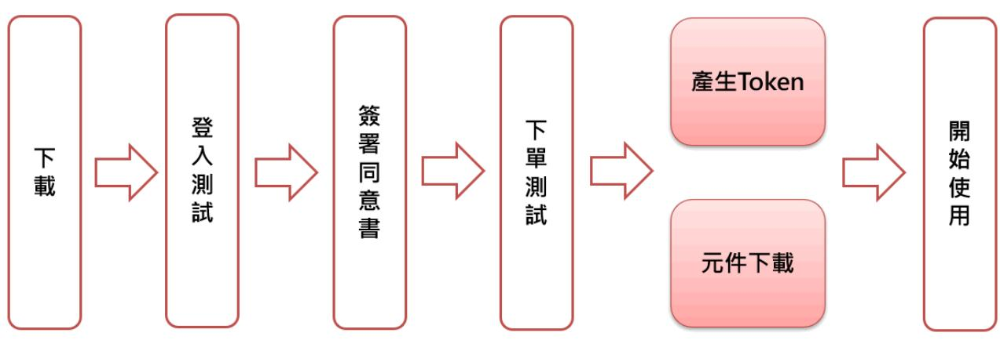

| 一、 | 下載 SINO API                | 2  |
|----|----------------------------------|----|
| 二、 | 憑證申請 (若您已有申請憑證,此項可跳過)         | 4  |
| 三、 | 登入測試 (提醒您:登入前請先完成憑證申請)        | 5  |
| 四、 | 簽署 API 電子交易風險預告書暨使用同意書  | 9  |
| 五、 | 下單測試,證券/期貨/複委託 需分別測試       | 12 |
| 六、 | 產生 Token(取得 API 設定檔)    | 15 |
| 七、 | 元件下載                             | 16 |

# **一、 下載 SINO API**

### 1. 在 永豐金理財網 →客戶支援→下單平台→API 下單

[https://www.sinotrade.com.tw/newweb/trading](https://www.sinotrade.com.tw/newweb/trading-platform/SINO/?category=&categoryCode=program)[platform/SINO/?category=&categoryCode=program](https://www.sinotrade.com.tw/newweb/trading-platform/SINO/?category=&categoryCode=program)

| SinoPac Securities |                          |        | 団 永豊金證券 國内證券 海外投資 期貨選擇權 財富管理 法人專區 客戶支援  快速下單 |      |       |  | នឹង |
|--------------------|--------------------------|--------|----------------------------------------------|------|-------|--|-----|
|                    | 客戶服務                     | 下置平台   |                                              | 密碼車區 | 常用功能  |  |     |
|                    | 新手上路                     | 平台總覽   |                                              | 線上解鎖 | 商品總覽  |  |     |
|                    | 智慧小豐                     | AP下置   |                                              | 密碼修改 | 最新公告  |  |     |
|                    | 常見問題                     | 網頁下量   |                                              | 線上補發 | 营業提貼  |  |     |
|                    | 卜或蔓區                     | 行動下單   |                                              | 臨價補發 | 粉絲蔓真  |  |     |
|                    | 與我感格                     | 交易平台教學 |                                              |      | 营業員查詢 |  |     |
|                    | 學習講座                     | 交易平台公告 |                                              |      | 客戶支援  |  |     |
|                    | 證券收費標準                   |        |                                              |      |       |  |     |
|                    | 福委託收費標準                  |        |                                              |      |       |  |     |
|                    | 開戶車區                     |        |                                              |      |       |  |     |
| PythonAPI          |                          |        |                                              |      |       |  |     |
|                    | 簡潔易用的API,用於 快速構建交易所需的 |        |                                              |      |       |  |     |

2. 點選 SINO API 圖示

### 3. 點選[立即下載]

| 交易平台 / SINO API    |                                            |
|--------------------|--------------------------------------------|
| SINO API           | 返回列表                                       |
| 可交易商品              |                                            |
| 台 股 期貨  第 美股 |                                            |
|                    | SINO API                                   |
| 操作説明      常見問題     | 202401新增:整合API 申請及測試驗證程 式,並提供API元件串接下單。 |
| 相關操作請點右邊操作說明       | 立即下載                                       |
|                    | 操作說明                                       |
|                    |                                            |
|                    | 相關公告 更多 >                               |

4. 將下載的 SINOAPI.zip 檔案後放置在 C:目錄下,解壓縮(在檔案按右鍵,點選 7-

Zip→解壓縮到"SINOAPI\"

## **二、 憑證申請 (若您已有申請憑證,此項可跳過)**

為落實資訊安全,並提供您更安全的登入認證機制,電子交易系統配合主管機關規範採 「雙因子認證」方式。除身分證字號及登入密碼外,尚須檢核有效電子憑證,才能使 用 API 各項函式。

1. "永豐金證券憑證申請軟體"載點如下:

[https://www.sinotrade.com.tw/UploadFiles/TCEM\\_SINO\\_PROD.exe](https://www.sinotrade.com.tw/UploadFiles/TCEM_SINO_PROD.exe)

2. 開啟憑證管理程式後,請輸入帳密登入完成 OTP 認證後,進行憑證申請。

| 8 永豐金融券憑證管理                                   |                                     | ×           |
|-----------------------------------------------|-------------------------------------|-------------|
| 過證 身分證字號: A123456789 當年 图偶:             | , 登入                             | Version:1.3 |
| 檢視憑證資訊 憑 農 申 晴 憑 燈 更 新 憑 證 註 銷       | -主機端憑證資訊 網頁訊息 × 直接聞始憑留申請?? |             |
| 愚環檔密碼愛更 愚燈檔密碼提示 操作 說 明 常用下載 匯入瀏覽器 | 曜定       取消                         |             |
| 憑證儲存位置                                        |                                     | 自行選取憑證      |
|                                               | 為了保障您的憑證密碼安全性,建議您憑證密碼擁每三個月至少變更一次。   |             |

**三、 登入測試 (提醒您:登入前請先完成憑證申請)**

1. 解壓縮後到安裝目錄 C:\SINOAPI,快速點二下開啟 TradeObjTest.exe 檔案。

- 2. 電子交易系統配合主管機關規範採「雙因子認證」方式。除身分證字號及登入密 碼外,尚須檢核有效電子憑證。故進行登入測試前,請先確認電腦中已存放有效 憑證。
- 3. 輸入身分證號及密碼,點選[登入]

| 答入                 |                 |                                                                                |      |
|--------------------|-----------------|--------------------------------------------------------------------------------|------|
| 20240122 日期:    |                 |                                                                                | 登入   |
| 身分證: SCCEIEFAJA | ****            |                                                                                |      |
| 狀態                 |                 |                                                                                |      |
| 證券                 |                 | 前往资署                                                                           |      |
| 其自信                |                 | 前往簽署                                                                           | 狀態更新 |
| 複素託                |                 | 前往资署                                                                           |      |
| 證券                 | 商品代號  0050 > | 買費別  買進 ▽ 盤別  普通 >                                                          |      |
|                    |                 | 類別  現股 ▽   委託條件  ROD ▽   張敏        價格  跌停 V                              | 下單測試 |
| 其月楼                | >               |                                                                                | V    |
|                    | 期貨 ~            | 商品代號 買費別   買進 > 盤別  盤中単 ▽   倉別   ROD   ▽   委託條件  新倉         價格  節電流 ▽ | 下單測試 |
| 複委託                |                 |                                                                                |      |
|                    | >               | 市場別  美國 √   商品代號  aapl.us                                                      |      |

4. 第一次登入會跳出檔案目錄,請選取憑證存放路徑: 例如:

C:\ekey\551\S1XXXXXXX4(您的 ID)\S

| 登入 20240118 日期: | 』 永豐金證券 SINO API 測試程式 (V20240118.01)                                  | ×            |
|-----------------------|-----------------------------------------------------------------------|--------------|
| 身分證: QCCAHIFFDH       | 密碼:  ****                                                             | 登入           |
| 狀態 證券 期貨        | 測覽資料夾 × 請選擇憑證權目錄                                                | 前往资署         |
| 複素託 證券             | 本標 A > 一下載 皇前 3D 物件 1                               | 狀態更新 下載測試 |
| 環股 短別 V 期權   | शा 文件 > 力 音樂 > Bi 影片 > ■片 1 本機位律 (C:)   |              |
| 盤中単 〜 赞别 複委託    | 新增益健區 (D:) > 一 數位金融處 (\\128.110.10.65\FileServer\部門資: > < | 下單測試         |
| 買賣別   買進 V         | 確定 取消                                                              | 下單測試         |
|                       | 産生Token   元件下載                                                        |              |

5. 若無有效憑證會出現資料格式錯誤,並顯示登入失敗

| ×                                                                                                                            | ×     |
|------------------------------------------------------------------------------------------------------------------------------|-------|
| 資料格式錯誤 Action=[Login] Data=[{"ResultOK":"0","ErrCode":"9000","ErrorMsg":"雙因子驗證失敗,失敗原 因: 使用者按下"取消"按钮(5070)(5070)" }] | 登入失败: |
| 罐定                                                                                                                           | 確定    |

6. 顯示登入成功,則表示雙因子驗證成功。

| ■ 永豐金證券 SINO API 測試程式 [Server:aplusrda.sinotrade.com.tw/tradedas] (V2024 X                      |                                                                             |      |  |  |  |  |
|----------------------------------------------------------------------------------------------------|-----------------------------------------------------------------------------|------|--|--|--|--|
| API棋疑環境的測試時間為:營業日8:00AM~20:00PM,諸於此時間進行測試。 誉人 日期: 20240125 密碼:  *** 身分證: QCCAHIFFDH |                                                                             | 巻入   |  |  |  |  |
| 狀態 證券                                                                                           | 前往簽署                                                                        |      |  |  |  |  |
| 直肖 複委託                                                                                          | 前往资署 前往簽署                                                                | 狀態更新 |  |  |  |  |
| 證券 商品代號  0050 >   現服 レ 奏託條件 ROD v 程刷                                                | × 盤別  普通 進 > 登入成功 ਵਿ                                         | 下單測試 |  |  |  |  |
| 期標  期貨 ▽ 商品代號 >                                                                              | 蛋定 買費別   買進 > 盤別  全日盤 ▽   倉別       委託條件  新倉 ▽   口數       價格  範圍市 ▽ | 下寬測試 |  |  |  |  |
| 複委託 市場別  美國   レ > 買費別 買進 ▽ 類別 ANY ▽▽ 数量       價格                                          | 商品代號  aapl.us 15 産生Token   元件下載                                       | 下單測試 |  |  |  |  |
|                                                                                                    |                                                                             |      |  |  |  |  |

## **四、 簽署 API 電子交易風險預告書暨使用同意書**

1. 登入成功後,會顯示證券/國內期權/複委託三個市場別的 API 電子交易風險預告

| ■ 永豐金證券 SINO API 測試程式 [Server:aplusrda.sinotrade.com.tw/tradedas] (V2024                                   |      | × |
|------------------------------------------------------------------------------------------------------------|------|---|
| API模擬環境的測試時間為:營業日8:00AM~20:00PM,諸於此時間進行測試。 왕入 日期: 20240125 密碼:  *** 身分證: QCCAHIFFDH         | 登入   |   |
| 状態                                                                                                         |      |   |
| 前往资署 證券部份簽署,部份下單測試                                                                                      |      |   |
| 期權部份簽署,部份下單測試 前往资署                                                                                      | 狀態更新 |   |
| 前往资署 複委託未簽署,未下單測試                                                                                       |      |   |
| 證券                                                                                                         |      |   |
| 證-松山9832603-#1 ▽  商品代號  1101     台泥 ▽ 買費別  買進 ▽ 盤別  普通 類別  現股 ▽ 委託條件  ROD ▽ ▽ 張數   價格  跌停 V | 下單測試 |   |
| 車関                                                                                                         |      |   |
| 台北9144112-#1 √   期貨 ▽ 商品代號   RFC4   布蘭特原油03 ▽   買賣別   買進 盤別 全日盤 ▽ 倉別 ROD ▽ 委託條件 新倉 ▽ □敷        價格 範囲市 ▽ | 下單測試 |   |
| 複素託                                                                                                        |      |   |
| 複-130009800762-蘇 ▽ 市場別  美國 ▽ 商品代號  aapl.us                                                              |      |   |
| 買費別 買進 ▽ 類別   ANY ▽ ▽ 数量       價格 15                                                                    | 下單測試 |   |
| 産生Token 元件下載                                                                                            |      |   |

書暨使用同意書是否簽署及測試狀態。

- 2. 證券/期貨/複委託 需分別簽署 API 電子交易風險預告書暨使用同意書。
- 3. 請分別點選該市場別右方[前往簽署]按鈕,開啟該市場別的簽署網頁進行簽

署。

| ■ 永登金證券 SINO API 測試程式 [Server:aplusrda.sinotrade.com.tw/tradedas] (V2024 X l                                                                                                                                                 |
|------------------------------------------------------------------------------------------------------------------------------------------------------------------------------------------------------------------------------------|
| API模擬環境的測試時間為:營業日8:00AM~20:00PM,請於此時間進行測試。 월入                                                                                                                                                                                   |
| 目期: 20240125 器人 密碼:  **** 身分證: QCCAHIFFDH                                                                                                                                                                              |
|                                                                                                                                                                                                                                    |
| 状態 前往签署 證券部份簽署,部份下單測試                                                                                                                                                                                                        |
|                                                                                                                                                                                                                                    |
| 期標部份簽署,部份下單測試 前往资署 状態更新                                                                                                                                                                                                      |
| 前往资署 複委託未簽署,未下單測試                                                                                                                                                                                                               |
| **                                                                                                                                                                                                                                 |
| 證-松山9832603-#1 ▽ 商品代號  1101     台泥       ▽ 買費別  買進 ▽ 盤別  普通 ▽                                                                                                                                                                   |
| 下留測試 類別 現股 ▽ 委託條件  ROD ▽  張數     鉄停 V                                                                                                                                                                                     |
| 其月花                                                                                                                                                                                                                                |
| 期-台北9144112-#1 ▽   ▽   明貨 ▽ 商品代號   BRFC4   布蘭特原油03 ▽   買賣別   買進                                                                                                                                                                    |
| 盤別  全日盤 ▽   倉別  ROD ▽   委託條件  新倉 ▽   口敷  1 價格   範囲市 ▽                                                                                                                                                                   下單測試 |
| 複委託                                                                                                                                                                                                                                |
| 複-130009800762-蘇 ▽   市場別  美國 ▽     商品代號 aapl.us                                                                                                                                                                                 |
| 下單測試 買費別 買進 ▽ 類別 ANY ▽ 1     價格 15 数量                                                                                                                                                                               |
| 元件下載 産生Token                                                                                                                                                                                                                    |

| Tr 永豐金證券 SinoPac Securities |         |                       | 國內證券  海外投資 期貨選擇權 客戶支援  財富管理 |                                                                                                                                                                                                                                                                                                 | 快速下盟 | 9 94 |
|--------------------------------|---------|-----------------------|-----------------------------|-------------------------------------------------------------------------------------------------------------------------------------------------------------------------------------------------------------------------------------------------------------------------------------------------|------|------|
|                                |         |                       |                             | 60 API電子交易風險預告書暨使用同意書 (證券)                                                                                                                                                                                                                                                                      |      |      |
|                                | 喜德之 :   |                       |                             | 立香人蔬向 最公司申请使用電子交易下單應用程式開發介面-Application Programming Interface(以下簡稱API)功能,以電子 方式從事交易,要託費公司提出管機關核進之交易市場進行交易,立書人在使用APIT的第二屆前位                                                                                                                                                                   |      |      |
|                                |         | ■ 一、立書人己申請電子(網路)交易帳戶。 |                             |                                                                                                                                                                                                                                                                                                 |      |      |
|                                |         |                       | 錯誤,致衍生任何問題或造成錯帳,均由立書人自行承擔。  | 、 、 、 、 、 、 、 、 、 、 、 、 、 、 、 、 、 、 、 、 、 、 、 、 、 、 、 、 、 、 、 、 、 、 、 、 、 、 、 、 、 、 、 、 、 、 、 、 、 、 、 、 、 、 、 、 、 、 、 、 、 、 、 、 、 、 、 、 、 、 、 、 、 、 、 、 、 、 、 、 、 、 、 、 、 、 該程式者:立書人使用API功能透過 骨公司電子交易平台而進行交易,但 資公司就立書人所使用之API元件學程式並無重新 結婚・修正之製利 ・か無確保受賞公司職子交易平台相容之義務・図書館端所在生之交易限制・環職職員の職業 |      |      |
|                                |         |                       |                             | 三、立書人除應妥著保管使用個人帳號。授權落選、自訂客碼及電子憑證外,不得增自授與他人或資訊廠商全盤委託交 易:凡經驗證國立書人之帳號、密碼及憑證所為之委託擔示,均應由立書人員全部之法律责任,與 贵公司黨涉。                                                                                                                                                                                      |      |      |
|                                | 估後自行為之。 |                       |                             | ■「四、AP後屬程式交易為電子交易之一種,買進度出訊號難經程式計算提出。但最終買賣之決策與執行應由立書人審慎評                                                                                                                                                                                                                                         |      |      |
|                                | 自費。     |                       |                             | 五、立書人隐殷朝由學子交易方式取得各類交易資料包含行情議動、即時資訊或其他資訊, 黃公司之此頂資訊提供不代 表動話立書人進行交易,且貴公司對於所提供之確訊難信息於一般認為可資信賴之來源,但是公司與相關資訊服務業無論 保核资讯之正確性或完整性之義務。立書人應就相關資訊自行獨立判斷。如因不可抗力或因 黃公司及第三人資訊服務業者難 以合理控制之其他原因,所致富訓錯誤。定婦或強調,而直接或開使產生之任何損害,多公司或第三人資訊服務業者會無需                                                             |      |      |
|                                |         |                       |                             | 六、如遇交易極為活絡及不可抗力情形包括但不限於断線、衝電、網路建築、系統要要對狀況」立書人的委託及成交回 報資訊可能有延遲或停止之情形,故立書人應隨時法常委託與執行狀況,如發現異常,應即向所屬營業員反應。                                                                                                                                                                                       |      |      |
|                                |         |                       |                             | 一七、立君人應遵守 賢公司所訂定使用API功能及下單所應證借之交易約定。如普停下單機制等。                                                                                                                                                                                                                                                   |      |      |
|                                |         |                       |                             | 一八、胃公司得因屈腔管理或其他因素考量,沒行限制或取消API介面連結,不需先行告知,                                                                                                                                                                                                                                                      |      |      |
|                                |         | 自顯承受相關風險,特此聲明。        |                             | 立書人已詳細胞讀以上內容:且死分了解API功能之注意事項及可能產生之相關風險及相關使用約定,並同意遵循上述條款                                                                                                                                                                                                                                         |      |      |
|                                |         |                       |                             | 因主管機關規定,風險預告書需逐條詳聞、確認勾選,並待開語等待秒數完成後,才能進行簽署。                                                                                                                                                                                                                                                     |      |      |

4. 因主管機關規定,風險預告書需逐條詳閱、確認勾選,並待閱讀等待秒數完成後

完成簽署。

✽請於各別開啟的證券/期貨/複委託的簽署網頁進行簽署,未簽署該市場別將無法下單使用。

5. 簽署完成後,可到 SINO API 程式,點選狀態更新後,即可查詢簽署狀態

| 『 永豐金證券 SINO API 測試程式 (V20240119.01)                        | ×    |
|-------------------------------------------------------------|------|
| 登入 日期: 20240122 密碼: *** 身分證: SCCEIEFAJA         | 登入   |
| 狀態                                                          |      |
| 前往资署 證券 一簽署,已下單測試                                        |      |
| 期權已簽署,已下單測試 前往资署                                         | 狀態更新 |
| 前往资署 複藝 # 品發電 已下單測試                                   |      |
| **                                                          |      |
| 證-台開9818649-#1 √ 商品代號  1101   台泥 レ 買費別  買進 ▽ 盤別   普通     |      |
| 類別  現股 ▽ 委託條件 ROD ▽ 張數  1                                | 下單測試 |
| 其月楼                                                         |      |
| 期-台北9104000-#1 √ 期貨 ▽ 商品代號  BRFC4 │ 布蘭特原油03 ▽ ▽ 買賣別│買進 V |      |
| 盤別 盤中単 ▽ 倉別 ROD ▽ 委託條件 新倉 ▽ □数 1     便格 範囲市 ▽               | 下單測試 |
| 複素託                                                         |      |
| 複-9A9509808719-3 √ 市場別 美國 √ 商品代號  aapl.us                   |      |
| 買賣別 買進 ▽ 類別 ANY ▽ ★ 数量  1     價格 15                      | 下單測試 |
| 産生Token 元件下載                                             |      |

### **五、 下單測試,證券/期貨/複委託 需分別測試**

- 1. 開放使用 API 模擬環境,請於營業日 8am ~ 8pm 進行 API 相關測試。
- 2. 證券/期貨/複委託 需分別下單測試,若有多帳號,請逐一進行下單測試。
- 3. 未簽署前,不可進行[下單測試]。
- 4. 簽署完成後,在 SINO API 進行下單測試,測試成功顯示:下單成功。

| 』永豐金證券 SINO API 測試程式 (V20240126.01) ×                                                                                        |
|---------------------------------------------------------------------------------------------------------------------------------|
| API棋疑環境的測試時間為:營業日8:00AM ~20:00PM,諸於此時間進行測試。 登入                                                                               |
| 日期: 20240129 登入 ******** 身分證: Q 密碼:                                                                           |
| 状態                                                                                                                              |
| 前往资署 證券 已簽署,已下單測試                                                                                                            |
| 期權 未簽署,未下單測試 前往资署 状態更新                                                                                                    |
| 前往资署 複委託 己簽署,未下單測試                                                                                                           |
| × **                                                                                                                         |
| 普通 證-松山9832603- : ▽   商品f 下單測試完成, 審核時間約5~10分鐘後,再點選狀態更新直詢。 下單測試 類別 現股 √ 委託條件                                      |
| 真相传 確定                                                                                                                       |
| ▽ 期貨 ▽ 商品代旅   BKPC4   布爾特原油03 ▽   買賣別  賞進 期-台北9144112- 盤別  全日盤 ▽   倉別  ROD ▽   委託條件  新倉 ▽   口數  1 價格   範囲市 ▽   下單則試 |
| 複委託                                                                                                                             |
| 市場別   美國   v   商品代號  aapl.us 1300-09800762-: > 下單測試 15 買費別   買進 ▽  類別 ANY ▽  数量 1 價格                       |
| 元件下載 産生Token                                                                                                                 |

5. 待 API 測試紀錄審核通過後(約 5~10 分鐘),即可開通 API 下單權限 (證券/期 貨/複委託需分別測試),API 電子交易風險預告書暨使用同意書的簽署狀態會顯示 已簽署(圖一),且 SINO API 程式的狀態會由未下單測試變成下單測試(圖二)。

圖一:

| 北京豐金證券 SinoPac Securities |                                                                    |                                               |                             | 國內證券  海外投資 期貨選擇權 客戶支援  財富管理          |         | 快速下單          | (蘇 | 품번 |
|------------------------------|--------------------------------------------------------------------|-----------------------------------------------|-----------------------------|--------------------------------------|---------|---------------|----|----|
|                              |                                                                    | 下载【API 電子交易風險預告書暨使用同意書】                       |                             |                                      |         |               |    |    |
|                              | 《注意事順》 前往 Python API 測試 > 前往 T4 API 測試 > 前往 SINO API 測試 > | 2. API測試紀錄當日審核完畢,隨到隨審。 簽署人身分證字號:QCCAHIFFDH | 3. 僅開放營業日進行API測試,API測試流程詳見: | 1. 線上簽署完畢,尚須進行API相關功能測試,才可完整啟用API服務。 |         |               |    |    |
|                              | 分公司                                                                | 帳號                                            | 的歌剧。                        | python 測試與否                          | T4 測試與否 | SINO API 測試與否 |    |    |
|                              | 9A91                                                               | 9832603                                       | 已等等                         | 未測試                                  | 未測試     | 已測試           |    |    |
|                              | 9A95                                                               | 9818296                                       | 未簽眾                         | 末測試                                  | 未測試     | 末測試           |    |    |
|                              | 9A9U                                                               | 9840926                                       | 未簽署                         | 未測試                                  | 未測試     | 末測試           |    |    |
|                              |                                                                    |                                               |                             | 第40 記                                |         |               |    |    |

圖二: (註:若為多帳號,部分帳號尚未簽署,則會顯示「部分下單測試」)

| ■ 永豐金證券 SINO API 測試程式 [Server:aplusrda.sinotrade.com.tw/tradedas] (V2024                                                                                                                    |       | × |
|---------------------------------------------------------------------------------------------------------------------------------------------------------------------------------------------|-------|---|
| API棋擬環境的測試時間為:營業日8:00AM ~20:00PM,諸於此時間進行測試。                                                                                                                                                 |       |   |
| 登入 日期: 20240125 密碼:  *** 身分證: QCCAHIFFDH                                                                                                                                        | 營人    |   |
| 大赢                                                                                                                                                                                          |       |   |
| 證券部份簽署,部份下單測試 前往资署                                                                                                                                                                       |       |   |
| 期權未簽署,未下單測試 前往等著                                                                                                                                                                         | 状態更新  |   |
| 前往资署 複委託未簽署,未下單測試                                                                                                                                                                        |       |   |
| **                                                                                                                                                                                          |       |   |
| 證-松山9832603-#1 √ 商品代號  1101   台泥 ▽ 買費別  買進 ▽ 盤別  普通 類別  現股 ▽ 委託條件  ROD ▽ 張數  1   價格  跌停 V                                                                                    | 下單測試  |   |
| 其相模                                                                                                                                                                                         |       |   |
| 期台北9144112-#1 ▽   ○   明貨 ▽ 商品代號   BRFC4   布蘭特原油03 ▽   買賣別   買進                                                                                                                              |       |   |
| 盤別   ------------------------------------------------------------------------------------------------------------------------------------------------------------------------ 便格   範囲市 ▽ | 下單測試  |   |
| 複素託                                                                                                                                                                                         |       |   |
| 複-130009800762-蘇 √ 市場別  美國 √ 商品代號  aapl.us                                                                                                                                                  |       |   |
| 買費別 買進 ▽ 類別 ANY ▽  数量               價格 15                                                                                                                                             | 下滑 測試 |   |
| 元件下載 産生Token                                                                                                                                                                             |       |   |

# **六、 產生 Token(取得 API 設定檔)**

1. 點選產生 Token,完成後會出現檔案已下載完成,請妥善保管此 API 設定檔。

| ■ 永豐金證券 SINO API 測試程式 [Server:aplusrda.sinotrade.com.tw/tradedas] (V2024                             | ×    |
|------------------------------------------------------------------------------------------------------|------|
| API棋疑環境的測試時間為:營業日8:00AM~20:00PM,請於此時間進行測試。 登入                                                     |      |
| 日期: 20240125 密碼:  *** 身分證: QCCAHIFFDH                                                       | 登入   |
| 狀態                                                                                                   |      |
| 前往资署 證券部份簽署,部份下單測試                                                                                |      |
| 期權部份簽署,部份下單測試 前往签署                                                                                | 状態更新 |
| 前往资署 複委託未簽署,未下單測試                                                                                 |      |
| × **                                                                                              |      |
| 訓   買進 證-松山9832603-#1 √ 商品代號 ャ   盤別  普通 110 檔案已下載完成 類別  現股 ▽ 委託條件  ROD ਹੈ। ਉਹ > | 下單刷試 |
| 罐定 直日本語                                                                                           |      |
| 期台北9144112-#1 √   明貨 √ 商品代號   BRFC4   布蘭特原油03 √   買東別  買進 ▽                                          |      |
| 盤別  全日盤 ▽   倉別  ROD ▽   委託條件  新倉 ▽   口數  1 便格   範囲市 ▽                                             | 下單測試 |
| 複委託                                                                                                  |      |
| 複-130009800762-藍 ▽   市場別  美國 ▽ 商品代號  aapl.us                                                      |      |
| 買費別   買進 ▽  類別 ANY ▽  数量 1 15 價格                                                               | 下單測試 |
| 産生Token   元件下載                                                                                       |      |

# **七、 元件下載**

1. 點選[元件下載]待程式執行完畢,即完成 SINO API 的測試及申請。

| ■ 永豐金證券 SINO API 測試程式 [Server:aplusrda.sinotrade.com.tw/tradedas] (V2024                                         | X    |  |
|------------------------------------------------------------------------------------------------------------------|------|--|
| API模擬環境的測試時間為:營業日8:00AM~20:00PM,請於此時間進行測試。 登入                                                                 |      |  |
| 20240125 日期: 密碼: *** 身分證: QCCAHIFFDH                                                                    | 登入   |  |
| 狀態                                                                                                               |      |  |
| 證券部份簽署,部份下單測試 前往资署                                                                                            |      |  |
| 期權部份簽署,部份下單測試 前往资署                                                                                            | 状態更新 |  |
| 前往资署 複委託未簽署,未下單測試                                                                                             |      |  |
| **                                                                                                               |      |  |
| 證-松山9832603-#1 √ 商品代號  1101     台泥   √ 買賣別  買進 √   盤別   普通 類別  現股 ▽ 委託條件  ROD ~   張數  1  跌停     價格 V | 下單測試 |  |
| 直日本語                                                                                                             |      |  |
| 期-台北9144112-#1 ▽   ○   明貨 ▽ 商品代號   RFC4   布蘭特原油03 ▽   買賣別   買進                                                   |      |  |
| 盤別  全日盤 ▽   倉別  ROD  ▽   委託條件  新倉 ▽   回数   便格   範囲市 ▽                                                         | 下單測試 |  |
| 複素託                                                                                                              |      |  |
| 複-130009800762-整 ▽   市場別  美國   ▽ 商品代號  aapl.us                                                                |      |  |
| 買費別 買進 ▽ 類別   ANY ▽ ▽ 敷量  1     價格 15                                                                         | 下單測試 |  |
| 元件下載 産生Token                                                                                                  |      |  |